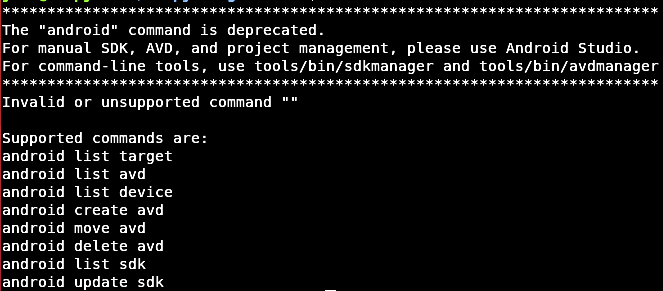

React-Native allows those with some Javascript ability to create a mobile App for an Android or IOS device, that would have previously been written for example in C.
There are many tutorials on how to setup Android Studio for Windows and Mac users but not too many for a Ubuntu user, which is understandably quite upsetting. This is a tutorial on how set your Android SDK paths.
ADB (Android Debug Bridge) hosts virtual devices, and run programs.
ADB was not configured on my laptop when installing Android SDK.

Open the command line, then type  
```
adb
```  

You should get a long list of commands associated with adb.
If that  has not happened you may not have adb installed and will most probably be offered a line of code in the command line, which you can run to install adb.
Just in case, here is that code:
```   
sudo apt-get install android-tools-adb   
```


Next check if android is working by typing:
```
Android
```
You may see a message “Command not found” .
Now we need to set the path for tools and platform tools so that your computer can use various commands available in each respective folder.


Locate and open the ‘Android’ folder. From home in the command line I typed:


    cd Android/Sdk/platform-tools/


Next we need the path to this directory.
`Ctrl + L` will highlight the path to your present location in your computer. Copy this path.


Navigate back to your home folder and find a hidden folder called .bashrc .
`Ctrl + H` will make visible hidden files in your folder.


Open .bashrc and scroll to the bottom of the page.
Then type:


```
export PATH=$PATH “~/Android/Sdk/platform-tools"
export PATH=$PATH "~/Android/Sdk/tools"
```

Save and exit .bashrc and open your command line again.
Type
```
adb  
```
 again and you should now have the log of commands I mentioned earlier.


On typing
```
android
```
you will most likely receive a message like this:



If you prefer to use the Android Studio from the command line, navigate to ~/Android/Sdk/tools/bin , where you can find avdmanager for virtual device controls and sdkmanager for studio controls.
NB. Type ./ before either command to execute each script.
